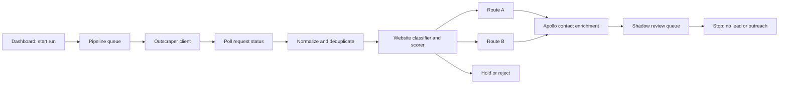

# Outscraper A/B Shadow Pilot Design

**Date:** 2026-07-22
**Status:** Approved in design discussion; pending repository review
**Target branch:** `dev`

---

## 1. Summary

PrinterIQ will add Outscraper as a discovery source before the existing lead pipeline. The first pilot will discover 300-500 independent plumbing businesses across Greater Brisbane, classify them into two offer routes, attempt Apollo contact enrichment, and stop in a dashboard-based shadow review queue.

- **Route A - PrinterIQ Build:** the business has no functioning owned website. Social profiles, directories, marketplaces, parked domains, placeholders, and repeatedly inaccessible domains do not count as owned websites.
- **Route B - Health Score Audit:** the business has a functioning owned website with a deterministic Website Health Score of 0-59, or a Route B critical failure.

Outscraper does not insert records directly into `leads`. A tenant-scoped prospect staging layer isolates incomplete, rejected, held, unresolved, and unreviewed businesses. V1 cannot promote a prospect to `leads` or enqueue Instantly outreach. A later, separately approved live experiment may add promotion after the shadow pilot passes its gates.

## 2. Why This Fits PrinterIQ

PrinterIQ currently starts with an Apollo CSV and assumes a contactable lead already exists:

```text
Apollo CSV -> ingest -> enrich -> qualify -> generate preview -> schedule outreach
```

The current ingest path requires an email and website, `leads.email` is non-null, and Apollo technology data can bypass a browser audit. That is appropriate for the original fixed Apollo cohort but cannot represent businesses discovered without a website or verified contact.

The new front end of the engine will be:

```text
Outscraper -> prospect staging -> normalization -> deterministic assessment
           -> Route A/B eligibility -> Apollo enrichment -> shadow review
           -> STOP
```

The existing lead pipeline remains unchanged. Outscraper is a discovery adapter, the scorer is the routing authority, Apollo is a selective contact resolver, and Instantly remains outside the V1 execution path.

## 3. Goals

1. Test whether Outscraper can produce a clean, economically useful Greater Brisbane plumbing cohort.
2. Measure the prevalence and precision of Route A and Route B opportunities.
3. Measure Apollo verified-email match rates separately for Routes A and B.
4. Make every automated route explainable from stored rule evidence.
5. Provide a reproducible, auditable 60-prospect shadow review.
6. Reuse PrinterIQ's tenant isolation, Postgres source of truth, Python worker, queue, and dashboard conventions.
7. Prevent any shadow-pilot record from reaching `leads` or Instantly.

## 4. Non-Goals

- Live email, SMS, phone, or CRM outreach.
- Reputation Management, GMB Optimisation, AEO, or Programmatic SEO routes.
- Automated approval or lead promotion.
- Replacing Apollo, Instantly, or the existing lead lifecycle.
- Building a generic multi-provider scraping framework.
- Scraping Google reviews beyond the rating and review-count fields returned with the business record.
- Solving multi-touch attribution or agency-partner revenue flows.
- Automatically deciding that a publicly listed contact address provides consent for commercial messaging.

## 5. Locked Pilot Boundary

| Dimension | Decision |
|---|---|
| Trade | Plumbing |
| Region | Greater Brisbane |
| Discovery volume | 300-500 unique businesses |
| Included sizes | Owner-operators and independent teams with up to three deduplicated locations |
| Excluded structures | National franchises, corporate chains, and businesses with more than three matched locations |
| Outreach contact | Apollo-verified business email only; public phone may be stored but is inactive |
| Execution mode | Shadow mode only |
| Validation sample | 20 Route A, 20 Route B, and 20 healthy/rejected prospects |

Greater Brisbane is defined for this pilot as Brisbane, Logan, Ipswich, Moreton Bay, and Redlands. Discovery queries may be subdivided by locality or suburb to obtain coverage, but normalization must produce one deduplicated run-level cohort capped at 500 businesses.

Search categories are `Plumber`, `Drainage service`, and `Gas fitter`. They form one plumbing cohort rather than separate campaigns. Suppliers, training providers, lead directories, permanently closed businesses, and businesses outside the region are ineligible.

## 6. Architecture

### 6.1 Components



### 6.2 Service Boundaries

- The Python pipeline owns Outscraper calls, polling, normalization, website audits, scoring, and Apollo contact enrichment.
- All Python database access goes through `services/pipeline/src/db/queries.py`.
- The Next.js dashboard reads run/prospect/assessment data and writes manual review assessments through `services/dashboard/src/db/queries.ts` and server actions.
- Provider secrets remain server-side environment variables and are never returned to browser components.
- No V1 worker or dashboard action calls the existing lead-ingest path, creates a `lead`, creates an `outreach_send`, or calls Instantly.

### 6.3 Queue Flow

The pipeline adds focused job types for:

```text
start_discovery
-> poll_outscraper
-> normalize_prospects
-> assess_prospects
-> enrich_prospect_contacts
-> prepare_shadow_review
```

V1 allows one active discovery run per tenant. Each stage is one run-level batch job with a deterministic idempotency key based on tenant, run, and stage. This works with the existing `queue_jobs` constraint for leadless jobs without adding a speculative per-prospect queue identity. A batch performs replay-safe per-prospect writes, and a single malformed business record is recorded as a prospect-level failure without failing the full run.

Polling is preferred over a provider webhook for V1. The worker stores the Outscraper request ID, schedules delayed polling, persists returned business payloads, and only then starts normalization. This avoids adding a new public webhook and its authentication surface.

## 7. Data Model

All primary and foreign-key access is tenant-scoped. Database migrations must follow existing PrinterIQ conventions and receive the mandatory `db-reviewer` review.

### 7.1 `discovery_runs`

One row represents one provider request and pilot cohort.

Required fields:

- `id`, `tenant_id`
- `source` (`outscraper` in V1)
- `source_request_id`
- `query_spec` JSON containing categories, included localities, locale, result cap, and query version
- `status`: `created`, `submitted`, `polling`, `persisted`, `processing`, `review_ready`, `completed`, or `failed`
- `shadow_mode`, constrained to `true` for V1
- provider and processing counts
- `failure_code`, `failure_detail`
- `submitted_at`, `results_received_at`, `review_ready_at`, `created_at`, `updated_at`

The provider request ID is unique within `(tenant_id, source)`. Run status only moves forward except that any active status may terminate in `failed`.

### 7.2 `business_prospects`

One row represents the canonical business within a tenant and source.

Required fields:

- identity: `id`, `tenant_id`, `discovery_run_id`, `source`, `source_business_id`
- business data: name, normalized name, primary category, additional categories, phone, normalized phone, address, locality, state, postcode, latitude, longitude
- Google data: business status, rating, review count, profile URL
- website data: source URL, normalized domain, ownership classification
- deduplication: canonical prospect ID when merged and duplicate evidence
- eligibility: franchise/multi-location flags, hold/reject reason, route
- lifecycle status: `discovered`, `normalized`, `assessed`, `contact_enriched`, `review_ready`, `held`, `rejected`, `failed`, `approved`, or `promoted`
- `lead_id`, nullable and unused in V1
- source payload JSON and its expiry timestamp
- timestamps

The primary source identity is unique on `(tenant_id, source, source_business_id)`. Google Place ID is the V1 `source_business_id`. Secondary duplicate matching uses normalized phone, normalized owned domain, and normalized name/address. Ambiguous matches are held for review rather than automatically merged.

`approved`, `promoted`, and `lead_id` reserve the future integration boundary. No V1 code path may set them.

### 7.3 `prospect_assessments`

Assessments are append-only and versioned. They store both automated scoring and manual review without requiring a separate review table.

Required fields:

- `id`, `tenant_id`, `prospect_id`, `discovery_run_id`
- `assessment_type`: `automated` or `manual_review`
- `assessment_version`
- automated fields: eligibility result, computed route, total score, category subtotals, rule evidence JSON, forced-route reason
- manual fields: reviewer ID, review decision (`correct`, `wrong_route`, `ineligible`, `needs_investigation`), corrected route, review note
- optional AI summary and prompt version; neither may alter eligibility, score, or route
- `created_at`

An automated assessment is unique per `(tenant_id, prospect_id, assessment_version)`. Manual assessments remain append-only so recalibration rounds retain their audit history.

### 7.4 `prospect_contacts`

One row represents one provider contact-resolution attempt.

Required fields:

- `id`, `tenant_id`, `prospect_id`
- `provider` (`apollo` in V1)
- input fingerprint and provider request/reference ID
- match status: `verified`, `unverified`, `no_match`, `suppressed`, or `failed`
- matched person/business metadata needed to audit the match
- email and provider email status
- match evidence and confidence classification
- provider payload JSON and its expiry timestamp
- timestamps

Only an Apollo email explicitly reported as verified satisfies the pilot contact gate. Unverified, catch-all, guessed, personal, role-ambiguous, or no-match results remain `contact_unresolved`. Route A attempts may use business name, phone, address, and location; Route B may additionally use the owned domain. PrinterIQ never invents an address when Apollo cannot resolve one.

## 8. Eligibility And Routing

Rules execute in this order so one prospect has one primary outcome.

### 8.1 Normalization Gates

Reject:

- permanently closed business
- non-plumbing category after normalization
- supplier, school, directory, or other non-service business
- address outside the defined Greater Brisbane boundary

Hold:

- known national franchise or corporate chain
- more than three deduplicated locations
- ambiguous duplicate identity
- rating below 3.5 with at least 10 reviews (`reputation_risk`)

Businesses with fewer than 10 reviews are not held on rating because the sample is not treated as meaningful. Missing ratings are allowed.

### 8.2 Website Ownership Classification

Route A applies when the business has no functioning owned website:

- no website URL
- Facebook, Instagram, or another social profile only
- directory, marketplace, booking platform, or lead marketplace only
- parked domain or generic placeholder
- domain fails two independent retrieval attempts separated by the retry policy

Redirects are followed before classification. A redirect to a social/directory destination is Route A. An accessible business-controlled domain proceeds to Route B scoring.

### 8.3 Website Health Score

The scorer is deterministic and versioned. V1 uses `website-health-v1` with 100 available points.

| Category | Points | Rule allocation |
|---|---:|---|
| Technical and mobile | 25 | reachable final page 5; valid HTTPS 4; usable mobile viewport/no horizontal overflow 6; main content available within 4 seconds 6; non-empty title and H1 4 |
| Conversion path | 25 | prominent tap-to-call phone 8; primary quote/contact CTA visible on mobile without opening navigation 7; contact form, email link, or equivalent usable contact method 5; emergency/hours clarity 3; website phone agrees with source phone 2 |
| Local relevance | 20 | Greater Brisbane or service area stated 6; at least three named suburbs or a service-area page 6; business name/address/phone consistency 4; valid LocalBusiness schema 4 |
| Trust and credibility | 15 | credentials or verifiable business identity 4; testimonials/review proof 4; genuine project/work photos 3; about/team information 2; privacy and complete contact details 2 |
| Service completeness | 15 | dedicated service pages or clear service sections 6; at least three plumbing services described 4; meaningful non-placeholder service copy 3; FAQ or useful customer guidance 2 |

Routing thresholds:

- **0-59:** Route B
- **60-69:** manual review
- **70-100:** healthy; no outreach route

A functioning owned site with no usable phone, form, email, or equivalent contact path is forced to Route B even if its numeric score is 60 or higher. Inaccessibility, parking, or placeholder content routes to A instead of acting as a Route B critical failure.

AI may summarize stored evidence and propose an audit angle after deterministic routing. It cannot add points, remove points, change eligibility, or change a route.

## 9. Shadow Review

The dashboard adds a run-level review experience. It shows:

- run status and counts for A, B, manual review, healthy, held, rejected, unresolved, and failed
- filters by outcome and processing state
- provider identity, Google profile link, website link, rating, review count, and Apollo match status
- exact rule evidence, category subtotals, final score, and forced-route reason
- any AI summary clearly separated from deterministic evidence
- manual decisions and corrected route
- precision metrics and provider cost/yield metrics
- CSV export of the reviewed cohort

The validation set contains exactly 60 eligible-for-sampling records when enough records exist: 20 Route A, 20 Route B, and 20 selected from healthy/rejected results. Selection is deterministic from discovery run ID, prospect ID, and cohort using a documented hash ordering. Refreshing or reopening a run cannot change its sample.

If any cohort contains fewer than 20 records, all available records in that cohort are selected and the run is marked `insufficient_sample`; it cannot pass the shadow gate.

V1 presents a persistent Shadow Mode indicator. There is no approve-for-promotion, create-lead, send, campaign, or Instantly control.

The review surface lives under the authenticated `/prospects` dashboard area, separate from `/leads`. It follows the existing server-rendered page plus filterable workbench pattern, derives the tenant server-side, and uses prospect-specific review actions. Existing lead actions, lead status badges, pipeline controls, and Instantly controls are not reused.

## 10. Error Handling And Idempotency

- Provider submission stores the external request ID before scheduling a poll.
- Polling treats pending provider state as a delayed retry, not a failure.
- Provider terminal failure records a stable failure code and ends the run.
- Results are persisted per business before normalization begins.
- Replayed result ingestion upserts by tenant/source/source-business identity without erasing later assessment or review state.
- Each processing stage records prospect-level failure codes and continues other records.
- Website timeouts use bounded retries. Two failed retrieval attempts are required before Route A inaccessibility classification.
- Apollo transport failures are retried; valid no-match responses are terminal contact outcomes and are not retried.
- Repeated enrichment jobs use an input fingerprint and cannot spend credits again for an unchanged prospect/provider input.
- Run aggregates are derived from stored prospect state rather than increment-only counters, avoiding drift after retries.
- Queue dead-letter behavior remains visible through existing operational mechanisms.

## 11. Security, Privacy, And Retention

- Outscraper and Apollo credentials are server-only environment variables.
- Every database read and write includes `tenant_id`.
- Dashboard access uses the existing authenticated operator boundary.
- Provider payloads expose no secrets to client components or exports.
- Raw Outscraper and Apollo payloads expire after 30 days.
- Rejected, held, and unresolved normalized prospects expire after 90 days unless needed for an active review.
- Promoted records, if introduced later, follow the existing lead/customer retention policy.
- Minimum suppression identity is retained to prevent re-import or recontact after opt-out.
- Suppression is checked during contact enrichment and must be checked again by any future promotion path.
- A public email or phone number is not treated as automatic consent for outreach.

Before any live activation, the design requires a separate Australian Spam Act and privacy review covering consent basis, sender identity, unsubscribe, contact-source disclosure, and handling of sole-trader personal information.

Outscraper's own guidance notes that Google Maps scraping and platform terms require legal and operational consideration. PrinterIQ must not describe the provider integration as eliminating that risk.

## 12. Pilot Success Gates

The pilot is technically viable only when all gates pass:

1. At least 70% of discovered records remain usable after removing duplicates, closed businesses, franchises, and out-of-region/non-trade records.
2. At least 20% of usable prospects qualify for Route A or Route B.
3. At least 30 correctly routed prospects also have Apollo-verified email addresses.
4. Manual review finds at least 90% eligibility precision.
5. Manual review finds at least 85% primary-route precision.
6. Fewer than 5% of records end in unexpected processing failure; valid provider no-match outcomes are excluded from this calculation.
7. No duplicate, suppressed, held, rejected, or out-of-region prospect is marked review-ready.
8. Provider spend and Apollo credits are reported per discovered, usable, routed, and verified prospect.
9. Route A and Route B yields and contact match rates are reported separately.

Passing these gates produces a go/no-go recommendation. It does not enable live outreach.

## 13. Testing Strategy

Implementation is test-first. Tests must use provider fixtures and fakes; automated tests do not spend Outscraper or Apollo credits.

Required coverage:

- migration constraints, tenant isolation, unique identities, and forward run state
- duplicate provider delivery and replay-safe persistence
- locality/category/franchise/multi-location/reputation gates
- social, directory, marketplace, placeholder, redirect, and inaccessible website classification
- every Website Health Score rule and both threshold boundaries
- Route B critical failure behavior
- AI summary isolation from deterministic route output
- polling pending/success/failure/timeout paths
- per-record failure isolation
- Apollo verified, unverified, catch-all, no-match, suppressed, retry, and input-fingerprint cases
- deterministic stratified sample selection and insufficient-cohort behavior
- dashboard loading, empty, error, partial-run, review, and export states
- a negative integration test proving shadow prospects cannot create leads, outreach sends, or Instantly requests

Focused service tests run after each task. Before completion, run the full pipeline and dashboard suites, dashboard lint/build, migration verification, and the repository's required reviewer agents.

## 14. Delivery Slices

1. **Governance and discovery foundation:** superseding ADR, schema, provider client, asynchronous submission/polling, raw-result persistence, and a run status surface.
2. **Route A tracer:** normalization plus no-owned-website classification through dashboard evidence review.
3. **Route B tracer:** browser audit, deterministic score, critical failure, and dashboard score evidence.
4. **Verified-contact tracer:** selective Apollo enrichment, suppression, unresolved outcomes, and review visibility.
5. **Shadow validation:** reproducible 60-record review, corrections, precision/cost reporting, export, and hard no-promotion guard.
6. **Controlled pilot:** provider configuration, Greater Brisbane query execution, threshold calibration, retention job, and written go/no-go report.

The later `$to-issues` pass should preserve these as thin vertical slices through schema, pipeline, dashboard, and tests, rather than creating separate database/backend/frontend tickets.

## 15. Governance And Documentation Impact

`docs/adr/003-apollo-only.md` records a Phase 1 decision that forbids new sourcing and scraping. Implementation must first add a new ADR that explicitly supersedes ADR 003 for this bounded shadow pilot. The ADR must preserve Apollo CSV as the existing production source, authorize Outscraper only for staged shadow discovery, record platform-terms and privacy risks, and prohibit live outreach without a later decision.

Implementation also updates:

- `docs/architecture.md` with the isolated prospect-staging flow
- `docs/queue-payloads.md` with all existing missing job documentation plus the new discovery jobs
- `.env.example` with server-only Outscraper and Apollo configuration names and safe non-secret defaults
- the operator runbook with start, observe, retry, retention, and abort procedures for a shadow run

## 16. External References

- Outscraper Google Maps fields: <https://docs.outscraper.com/endpoints/google-maps-search/>
- Outscraper asynchronous request polling: <https://docs.outscraper.com/endpoints/requests-requestid/>
- Outscraper pricing: <https://outscraper.com/pricing/>
- Outscraper discussion of Google Maps API and scraping terms: <https://outscraper.com/google-maps-api-vs-web-scraping/>
- Apollo People Enrichment: <https://docs.apollo.io/reference/people-enrichment>
- ACMA spam guidance: <https://www.acma.gov.au/avoid-sending-spam>
- OAIC APP 3 collection guidance: <https://www.oaic.gov.au/privacy/australian-privacy-principles/australian-privacy-principles-guidelines/chapter-3-app-3-collection-of-solicited-personal-information>
- ABS Greater Brisbane growth context: <https://www.abs.gov.au/statistics/people/population/regional-population/2023-24>
- Jobs and Skills Australia plumber profile: <https://www.jobsandskills.gov.au/data/occupation-and-industry-profiles/occupations/3341-plumbers>
